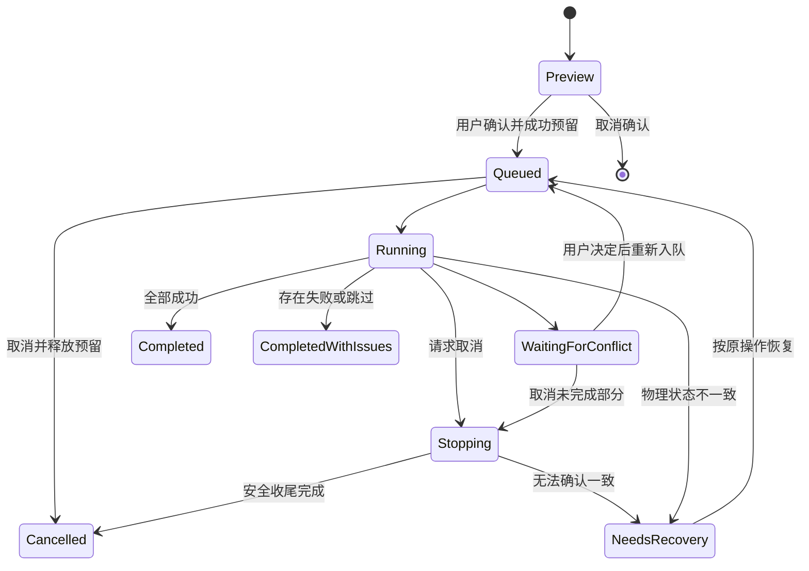

# 资源移动面板设计

日期：2026-09-29。状态：已按此方案实现，实施记录见第 13 节。前 12 节保留设计意图及验收依据。

## 1. 产品定位与推荐默认值

把反复「右键 → 选择移动 → 浏览目录」变成「保存目标 → 选资源 → 拖到目标 → 确认」，让用户持续整理资源。

面板包含两个长期并存的区域：上方是目标路径，下方是移动任务。路径是可以重复使用的目标；每次确认后的拖放是一批独立任务。面板是否打开、目标是否仍在收藏列表中，不影响已经提交的任务。

| 项目 | 推荐默认值 |
| --- | --- |
| 名称 | 移动面板；工具栏入口「移动资源」 |
| 展示 | 无蒙层、非模态浮动工具窗，可切换右侧占位停靠 |
| 新增路径范围 | 当前资源 Tab，可明确切换为所有资源 Tab |
| 移动确认 | 每批必需；自动覆盖也不跳过移动确认 |
| 冲突策略 | 询问用户；支持本次、本任务、整个移动面板的自动覆盖 |
| 执行方式 | 沿用现有串行执行；允许连续提交多个排队批次 |
| 任务可见范围 | 所有由移动面板提交的任务，标注来源 Tab，可筛选当前 Tab |
| 关闭面板 | 仅隐藏；任务继续，可从工具栏重新打开 |
| 取消含义 | 停止后续移动，保留已完成部分；不等于把文件搬回原处 |

## 2. 面板容器与最小化

### 浮动模式

用户所说的 modal，更适合实现成非模态工具窗：没有背景遮罩、不锁定列表焦点，列表继续支持选择、滚动、拖动。真正的确认弹窗只在放下资源后出现。

- 初次出现在资源区右侧，建议初始约 420 × 580 px，最小约 340 × 360 px，并受可用空间约束。
- 标题栏拖动；四边与四角均可调整尺寸。路径排序手柄、标题栏拖动、资源拖动分别使用不同的命中区域。
- 保持在资源列表上层、确认框下层。位置和尺寸限制在可见区域内；窗口变小或切换显示器后自动校正。
- 标题栏提供「停靠右侧」「最小化」「关闭」。关闭不是取消任务。
- 路径列表与任务列表之间可调整高度比例，二者分别滚动；任务多时不把目标路径挤出视口。

### 停靠模式

- 右侧分栏占据布局空间，资源列表真正缩窄重排，不能只换成另一个覆盖式 Drawer。
- 分隔线可调整宽度；建议 360–520 px 范围起步，服从可用宽度。
- 切换浮动/停靠使用同一组路径、选择和任务状态，不重建移动会话。
- 记住用户选择的展示模式和本设备窗口几何信息；不同 Tab 共享展示模式。
- 狭窄窗口降级为可收起的面板，并保留「移动所选」按钮入口，不能要求用户必须拖放。

### 最小化

- 收起成资源区边缘的紧凑图标：空闲、执行进度、排队数量、待处理数量。
- 执行进度展示当前执行任务的百分比；不把不断加入的排队任务混算成一个跳变的总百分比。
- 有冲突或失败时显示数字和文字提示，不能只依靠颜色；不自动抢焦点展开。
- 单击展开并恢复之前的位置、尺寸和模式。停靠模式最小化后归还列表宽度。
- 拖着资源悬停图标约 400–600 ms 可展开；必须继续拖到具体路径，不能直接投放到图标并默认使用上次目标。

## 3. 一次移动的完整交互

1. 打开移动面板，添加或选择常用目标目录。
2. 在资源列表中选择资源。拖动已选卡片时，携带当前 Tab 的选择快照，浮层显示「移动 12 项」。
3. 合法路径行高亮，显示目标和可移动数量；非法目标显示原因。非路径区域和聚合标题不接受放置。
4. 放下后请求现有 Preview 能力，进入本次操作的预览状态。此时没有服务端执行任务。
5. 显示一次紧凑确认：数量、完整目标路径、来源摘要、媒体库/属性影响、冲突及连带子资源。按钮明确写「确认移动 12 项」。
6. 确认后提交一次请求。服务端重新验证并原子预留资源与路径，返回批次；任务卡立即出现，资源显示「排队中」或「移动中」。
7. 只从选择集合移除本次已提交资源，用户可以马上选择下一批，拖到另一个目标。
8. 任务通过同一套移动服务完成，更新路径、媒体库、搜索结果。仍满足搜索条件的资源保留；不再满足条件的资源离开列表。

### 确认内容

- 明确「选择数量」与「实际移动的顶层资源数量」。父目录与子资源同时选中时不重复移动。
- 未选中的子资源也可能随父目录移动，必须显示「同时影响 N 个子资源」，支持展开。
- 对没有本地文件、已被任务占用、已经位于目标目录中的资源，明确列出排除原因与最终数量，不能悄悄跳过。
- 预览期间占用状态发生变化时，返回新情况并重新确认；不在用户确认后静默缩减批次执行。
- 完整目标路径始终可查看与复制，别名和媒体库标签不能替代实际路径。
- 请求发出前取消确认或按 Esc 不创建任务，保留原选择并释放本地准备状态。请求已发出时进入提交状态，Esc 只能隐藏界面，不能冒充取消服务端操作。
- 确认期间冻结本次资源与目标快照。即使切换 Tab、修改路径别名或列表刷新，本次目的地都不能跟随变化。
- 每批只需一次移动确认；只有新出现或需要额外决定的冲突才再次请求处理。
- 现有旧弹窗支持记住「不再确认」。新面板不继承这一选项，以满足本功能每批确认的要求。

### 拖动和框选的分工

现有资源列表允许从卡片封面开始框选，并会阻止原生 dragstart，不能简单增加一个 dropzone。

- 面板已启用（展开或最小化）时，从已选卡片拖动超过阈值进入资源移动；从空白或未选封面拖动保留框选行为。完全关闭面板时恢复原手势。
- 无修饰键从已选卡片拖动才进入移动；现有 Ctrl/Cmd/Alt 等选择修饰键保留框选加减语义。卡片点击、资源打开行为维持明确的优先级，拖动结束不再触发点击打开。
- 如果需要保留所有旧手势，可在选中卡片上提供可见拖动手柄，作为稳定的附加入口。
- 目标行提供「移动所选」按钮，键盘及不便拖动的用户也走完全相同的预览/确认流程。
- 新面板中的点击、排序、缩放和确认操作不应触发列表的全局点击清空选择。
- 资源移动与路径排序使用不同拖动类型。资源负载只携带 ID、来源 Tab、动作及请求标识，不把操作系统文件拖入视为资源移动。

### 右键入口

保留用户熟悉的「移动资源文件…」文案，动作改为展开移动面板，并预装本次资源选择。用户随后点击路径上的「移动所选」即可确认，不必再次拖动。

右键已有选中资源时沿用选择集合；右键未选资源时以该资源为操作对象。新增路径时保留待移动集合，选好目录后继续确认。工具栏也应有常驻入口，面板已开时只激活现有面板。

资源卡片还会出现在首页、集合、比较页和子资源弹窗。应用层保留统一打开命令；资源页之外调起浮动面板，只显示全局路径，来源标为对应页面，sourceTabId 为空，不偷偷归属最近使用的 Tab。停靠仅在支持它的资源页生效。

## 4. 路径管理、媒体库与聚合

每个路径条目展示：排序手柄、别名或末级目录名、路径上下文、相关媒体库、作用域、打开目录图标和更多菜单。拖放命中区域为整行主体，图标操作与拖放事件隔离。

### 新增、编辑和移除

- 复用现有文件浏览器选择实际目录，可参考已有媒体库路径；无需媒体库也能保存目标。
- 支持可选别名、修改目标路径、修改范围、拖拽排序、逻辑移除。
- 「从面板移除」只删除目标配置，不删除目录、不删除资源、不取消任务。提供撤销移除。
- 修改或移除路径只影响后续操作；已经提交的任务使用不可变目标快照，保留原路径和目标名称。
- 目录离线、挂载点消失或无权限时保留条目，显示不可用原因并禁止提交，不自动创建同名目录。
- 路径合法性由服务端按实际文件系统判断，比较必须按目录段、卷与文件系统大小写规则处理。不能简单全部转小写或用字符串 startsWith 判断。
- 「打开文件夹」复用现有宿主能力；若当前远程/浏览器环境无法打开对应机器的目录，应说明位置并提供复制路径或内置浏览器，不假装已在本机打开。

### 作用域

路径区明确分为「所有 Tab」和「当前 Tab」，用可见标签区分，避免把作用域只藏在图标中。

- 当前 Tab 路径关联稳定的 SavedSearch/ResourceTab ID，不关联可改名的标题或组件实例。
- 所有 Tab 表示当前 Bakabase 服务实例/配置中的全部资源 Tab；不默认扩大为所有设备文件系统或所有用户共享。
- 路径业务配置持久化；面板位置、宽度、折叠状态属于设备级偏好。刷新页面恢复路径，不依赖组件仍然挂载。
- 切换 Tab 时只切换局部路径集合，全局路径与后台任务继续存在。
- 关闭 Tab 不停止任务；局部路径随 Tab 配置清理规则归档，任务保留来源名称快照，显示「来源 Tab 已关闭」。
- 相同标准化路径在同一范围去重；全局路径存在时新增相同局部路径直接使用全局条目。局部提升为全局时合并已有同路径条目，保留可撤销的合并记录，而非只隐藏局部副本；此后移除全局路径不会突然出现一份隐藏副本。
- 拖排序手柄仅在同一作用域内有效，跨作用域显示禁止；范围变化通过明确的「设为所有 Tab 可用」操作完成。

### 媒体库信息

- 路径条目展示该路径上相关的媒体库标记，可展示多个；没有时显示「无关联媒体库」。
- 路径标记可能是动态匹配，条目中的标签只能说明相关性。当前 Preview 只返回目标落点的标记效果，可表达目标预计匹配哪些库；若要展示完整的「预计进入/离开哪些媒体库」及属性差异，需要扩展源位置与目标位置比较，不能把目标效果直接解释成完整增减差异。
- 不保证路径永远只对应一个媒体库，不把目标路径和媒体库做一对一绑定。标记修改后刷新展示。

### 共同前缀聚合

采用浅层路径分组，不做完整文件管理器树。

- 同一作用域内至少两个目标共享有意义的目录前缀时，显示公共前缀一次，子项展示相对路径。
- 按完整目录段聚合，不能把 `/media/a` 和 `/media/abc` 当作包含关系；跨盘符/共享根不合并。
- 根目录本身、只有一个子项的层级不需要独立分组；建议最多两层，保留完整路径查看能力。
- 聚合标题只是展示，不是可投放目录；如果父目录也被用户保存，显示它自己的目标行。
- 用户排序优先：按手动顺序排列后，对相邻共享前缀的目标做压缩。跨组拖动改变顺序，可拆分聚合；不因自动分组又把条目排回去。
- 可切换「平铺/按路径聚合」。默认路径少时平铺，多时建议用户开启聚合，不能在整理过程中自动重排目标。

## 5. 任务卡片与调度

每次确认对应一个 Batch/Job；资源级记录是其中的子项。连续投放到同一路径也保留为独立批次，避免用户取消时范围不明确。

任务卡最少包含：目标路径、来源 Tab、资源数、状态、进度、处理数量、错误/冲突数量和适用动作。展开可查看每个资源的来源、目标、结果和错误。

| 状态 | 展示与动作 |
| --- | --- |
| 排队中 | 展示排队原因或前方批次数；可以取消 |
| 执行中 | 进度条、当前资源、已处理/总数；可以停止 |
| 等待处理 | 展示同名冲突及覆盖/跳过/取消动作，不弹出打断后续操作的全局窗口 |
| 正在停止 | 说明正在完成或清理当前操作；仍不可重复移动 |
| 已完成 | 成功数量与完成时间 |
| 部分完成 | 成功、跳过、失败、取消的数量分别列出，不能表现成全批成功 |
| 失败/已中断 | 错误原因、重试和查看位置；持久化到下次启动 |
| 需要恢复 | 物理文件与资源记录尚未确认一致，提供恢复操作后再释放占用 |

- 活跃和待处理任务持续可见，完成历史可折叠。处理中的卡片不因状态变化跳到鼠标下方；待处理计数提供定位。
- 切换 Tab、最小化、关闭面板都不停止任务。默认显示面板全部任务，可筛选当前 Tab，筛选时仍提示其他 Tab 的待处理数量。
- 面板与全局后台任务页展示同一个任务实体和同一批次，不创建两套执行器。
- 初版沿用当前 MoveResources、资源同步、路径标记同步、File Mover 之间的互斥与串行策略，不额外提高物理移动并发。
- 等待用户处理冲突时，应持久化等待状态并让出执行槽位。其源/目标路径预留继续生效，但不相关的后续批次仍可执行。
- 这里需要新增「挂起执行、等待决策」协议：不能直接使用现有 Pause（仍占执行槽），也不能让执行器正常返回并被视为 Completed/100%。全局后台任务页同样显示待处理状态，只有 ResolveConflict 才能将它重新入队。
- 如果同步任务暂时无法识别持久化预留路径，则在接入前仍需阻止会触碰这些路径的同步，不能仅让出 BTask 槽位就假定安全。

### 进度的准确含义

- 现有批次进度按资源数量平均，并包含当前资源进度，可以作为第一版依据。显示「已处理 3/10」并分列成功/失败，不把 30% 解释成已移动 30% 字节。
- 同盘重命名可能瞬间完成；准备、扫描、提交和数据更新阶段使用状态文字或不定进度。
- 真正支持字节进度后再增加速度、已移动大小与预计剩余时间，不能根据资源数捏造字节/时间估计。
- 待冲突任务保留已有进度并显示等待状态；处理完全部条目但存在错误时不能显示纯绿色「100% 成功」。

## 6. 资源占用与取消语义

占用必须由后端保证，前端负责及时反馈。一个资源在所有资源 Tab、旧移动入口、重试入口看到一致的占用状态；父子路径相关资源也受保护。

### 两类准备状态

- 预览/确认草稿：前端临时占用涉及资源及已知连带子资源，按集合相交判断，不能仅拦截完全相同的资源集合；请求发出前关闭确认立即释放，不生成遗留任务。这只保证本客户端多个入口一致，其他客户端由正式提交时的服务端原子预留兜底。
- 已确认、正在提交或服务端排队：属于真实任务。提交阶段做乐观占用，收到明确拒绝后撤销；服务端正式预留覆盖排队、执行、等待冲突和正在停止阶段。
- 请求超时或断线不是明确失败：显示「确认提交结果中」，使用同一幂等键查询/重试，在查明已创建或确实未创建之前不解除占用。关闭面板也不能按未提交草稿直接释放。

服务端在 CreateBatch 中重新验证路径与资源并原子预留。仅靠 Preview 或列表上的 disabled 不足以处理重复点击、跨 Tab 和其他客户端的并发请求。创建请求需要幂等键，网络重试不能再建一批。

### 取消必须达到「可以安全再次移动」

用户期望取消后恢复可移动是正确的，但「点击取消」和「取消完成」要区分。

- 尚未执行的批次：直接取消排队与所有未开始记录，释放预留，恢复可移动。
- 正在执行的批次：立即进入「正在停止」，不再开始下一个资源。当前资源在可验证的安全边界停止；保留已经成功的移动。
- 第一版推荐以资源为取消边界：已经开始的资源完成物理移动与数据库修正，再将其余资源标为取消。界面明确「完成当前资源后停止」，这避免对现有移动原语承诺不存在的即时回滚。
- 面板、资源卡片和全局后台任务页的取消入口统一走 CancelBatch。持久化取消请求，并在当前资源安全提交后检查；正常取消不能继续调用会立即打断物理原语的通用 Stop，绕过上述边界。
- 若增加复制过程中的快速取消，只能在能保留完整源、清理本次临时输出且不影响原目标的情况下提供；否则继续到安全边界。不得直接中断后无条件解锁。
- 只有服务端确认位置、元数据和任务状态一致之后，才发送解除占用事件。正常取消完成后，资源在实际当前位置重新可移动。
- 取消不撤销已完成的移动。任务显示「已移动 4 项，取消 6 项」，而非误导为 10 项全部未移动。
- 意外退出、磁盘离线或收尾失败无法达到一致状态时，进入「需要恢复」，不伪装为已取消；恢复后再解锁。这里需要扩展现有启动恢复与锁恢复机制。
- 服务启动时先重建等待处理/需要恢复的预留，再开放移动与同步调度；不能等打开面板才恢复锁。恢复或解决冲突后原子续用已有预留，不能对自己仍持有的批次重复 TryReserve。
- 不必对取消再加一层确认弹窗；按钮文案和状态说明取消边界，避免日常操作再次变繁琐。

对失败也按物理状态处理：移动前验证失败可释放；涉及部分物理修改或元数据未提交的失败须保留恢复信息与必要预留，不能只看 Failed/Cancelled 枚举判断是否可再移动。

## 7. 同名冲突与自动覆盖

冲突是一个可处理的业务状态，不只是一段异常字符串。即使预览没有冲突，执行时仍须检查，因为目标文件可能随后出现。

### 任务内处理

任务卡展开冲突详情：来源与目标完整路径、文件类型、大小、修改时间，以及冲突数量；没有可靠数据的字段不展示。

操作包括：

- 「覆盖当前冲突并继续」；
- 「跳过这个资源并继续」；
- 「取消未完成部分」。

跳过以整个资源为单位；如果已经开始移动其内部内容，必须先回到一致状态，不能只跳过一个内部文件就把资源拆散到两边。

覆盖适用范围提供互斥选项，默认仅当前冲突：

| 范围 | 语义 |
| --- | --- |
| 仅当前冲突 | 只授权这一次具体替换 |
| 当前任务 | 对该批次剩余同名文件冲突自动覆盖，不影响下一批 |
| 本面板所有任务 | 对本服务/配置下由移动面板产生的待处理与后续任务生效，跨资源 Tab；不影响下载器或通用 File Mover |

- 策略优先级为：单次明确决定 > 任务明确设置 > 面板默认设置；任务可明确选择始终询问。
- 面板自动覆盖默认关闭，用户主动开启后持久化，并在标题/设置处持续显示「自动覆盖已开启」。可以随时关闭。
- 开启全局选项的动作明确说明会作用于继承默认策略的当前等待任务和以后任务；不是只保存一个新任务默认值。
- 关闭自动覆盖仅影响尚未执行的替换，不尝试中途撤销已经开始的文件操作。
- 策略授权和实际生效决定都记录在任务内，重启后仍能解释为何发生覆盖。
- 覆盖授权不取消每批移动的二次确认。两者分别防止选错目的地和处理同名冲突。

### 覆盖不是简单的 overwrite=true

- 普通文件同名：以安全替换实现。新内容先完整落地，保留原目标直到替换提交；失败不能把原目标当作临时输出删除。
- 同名目录：建议默认定义为「合并目录，保留目标独有内容；遇到同名文件按所选策略处理」。确认中明确写目录合并，不能暗中删除整个目标目录。
- 文件/目录类型不同：停止并要求明确处理，不在自动覆盖范围内。
- 目标已经对应另一个 Bakabase 资源，或覆盖会涉及其子资源：升级为资源身份冲突。先明确如何保留/合并 ID、标签、收藏与其他元数据；普通文件自动覆盖不授权删除另一份资源记录。
- 同一批选择了来自不同目录但同名的资源、计算后落到同一目标：预览时直接列为批内落点冲突，要求调整选择或目标。不能让后执行项依据自动覆盖策略覆盖前一项。
- 这些目标冲突检查在实际执行和冲突解决时再次进行，不能只依赖一次 Preview。
- 第一版可将资源身份冲突保留为人工处理，仍支持一般文件冲突覆盖；不得直接沿用路径改写制造重复资源。
- 对目录合并或替换需要明确记录本次创建/替换的文件与提交阶段，清理时只能处理本任务拥有的临时输出。现有「PhysicalMoveStarted」布尔值不足以证明外来目标的所有权。

## 8. 底层复用与必须补齐的能力

| 当前能力 | 设计结论 |
| --- | --- |
| CreateBatch + 持久化资源记录 + BTask | 保留，作为唯一移动执行通路 |
| Preview：目标、冲突、标记效果、连带子资源 | 复用并增强不可移动原因和冲突类型 |
| ResourceMoveGuard：资源 ID、源/目标路径及父子关系互斥 | 复用核心规则，扩展持久化等待/恢复阶段的占用 |
| BTask 进度、暂停/继续/停止及前端推送 | 复用通用执行信息，新增批次业务状态投影 |
| 移动后的路径修正、缓存失效、标记同步、搜索结果同步 | 延续原服务，并补齐批量连续移动场景的验证 |
| 失败/取消/中断记录和显式重试 | 保留，扩展安全恢复和任务级重试，成功项不重复执行 |
| 通用 BTask 停止 | 排队任务不能直接假定可取消，需领域级 CancelBatch |
| 外来目标覆盖 | 尚无完整支持，需冲突决策状态机与安全替换 |
| 路径收藏、作用域、排序、逻辑删除 | 新增业务配置 |
| 浮动/停靠/最小化与列表拖动协议 | 新增前端交互 |
| 批次来源 Tab、目标快照、冲突策略、幂等键 | 新增持久化批次数据 |

代码阅读中特别需要注意：当前执行结束 finally 会释放路径锁；排队 BTask 的 Stop 在没有执行 cancellation source 时不能完成领域取消；现有覆盖只用于续做同一记录留下的目标，跨卷失败清理可能删除该目标。把外来冲突直接设为 overwrite=true 会破坏其安全假设。

当前前端完成后的搜索刷新只处理 Completed/Error，不包含部分成功后 Cancelled，并且依赖固定 1.5 秒等待索引。新设计需对取消、部分完成和恢复后的已变更资源也触发刷新，并以受影响资源及索引更新确认或有界重查保证最终一致，不能仅沿用一次固定延时。

## 9. 状态、数据和接口边界

建议设置应用级 MovePanelCoordinator/store 与统一打开命令，资源页提供停靠位置；浮动和停靠只替换容器。选择仍归来源 Tab/页面，任务与占用归服务端，路径按业务作用域持久化，窗口几何归本地设备。

| 数据 | 建议字段/责任 |
| --- | --- |
| MoveDestination | id、标准化 path、别名、scope、ownerTabId、order、isDeleted、版本 |
| MovePanelPreferences | 默认展示模式、自动覆盖策略；窗口位置/尺寸另存本地 |
| MoveBatch | id、origin、sourceTabId/name 快照、destinationId、目标路径快照、幂等键、任务策略、状态、时间 |
| MoveRecord | 保留现有资源级记录；增加结构化错误、冲突决定、执行/恢复阶段及可安全释放标志 |
| MoveReservation | 逻辑上记录资源、源/目标路径和持有批次；等待处理、恢复及重启时可重建 |
| LiveTaskProjection | BTask 执行进度与持久化 Batch/Record 的统一视图，UI 不靠猜测推断占用 |

建议状态流：

Cancelled 表示批次停止完成；它仍可包含 Succeeded 子记录。最终展示从子记录计数得出，不能把所有子项一起覆盖成 Cancelled。

接口职责建议：

- 路径配置的读取/新增/修改/逻辑删除/排序；排序要携带版本防止并发覆盖。
- Preview 继续沿用现有服务，返回有效集合、连带影响、预期标记、冲突类型及不可移动原因。
- CreateBatch 增加来源、目的地快照、幂等键、策略字段；确认快照失效时返回可重新确认的结果。
- 批次查询支持活跃集合、分页历史与来源过滤，不仅查询最近 100 条记录后在浏览器拼接。
- CancelBatch 统一处理排队、执行、等待冲突及幂等重复取消；不要由前端直接删 BTask 冒充取消。
- ResolveConflict 接收冲突 ID/版本和适用范围，再验证当前文件状态；新文件或已变化的冲突不能复用过期的单次授权。
- RetryBatch 只重试有资格的失败/中断项，不重复移动成功项；保留已有单记录恢复入口。
- 推送批次、记录、进度和锁变化；重连时先拉完整活跃快照，再接增量，处理乱序与重复消息。
- 清理历史与删除路径配置分离；恢复中的记录不能被「清空已完成」移除。

无需为这个面板另建文件搬运器；新增的是移动业务编排、路径配置与交互层，物理执行继续通过现有服务演进。

## 10. 实施顺序

1. **取消和一致性基础**：修复排队取消，定义停止边界、恢复状态、权威占用及幂等创建，补齐相关后端测试。
2. **日常整理闭环**：路径配置与作用域、共用面板状态、浮动/停靠/最小化、选择拖放协议、每批确认、任务进度与右键入口切换。
3. **冲突处理闭环**：结构化冲突、等待后让出执行槽、单次/任务/面板策略、安全替换与目录合并、身份冲突保护。
4. **可读性与恢复体验**：公共前缀聚合、排序撤销、任务历史、重连恢复、不同窗口尺寸与键盘操作验证。

这些是开发顺序，不表示可以在取消或覆盖语义不完整时对用户开放相关按钮。完成本需求的可交付版本包含两种容器模式、作用域、排序/逻辑删除、确认、任务进度、取消及约定范围的冲突处理。

## 11. 验收场景

| 场景 | 预期 |
| --- | --- |
| 连续向 X、Y、X 拖动三批资源 | 产生三批独立任务，每批一次确认；后续选择不被前一批完成事件清空 |
| 取消确认 | 不建任务、不移动文件、保留选择、解除草稿占用 |
| 连点确认/请求超时后重试 | 同一幂等键只创建一批 |
| 同一资源在两个 Tab 提交 | 第二次在后端被拒绝；父子目录重叠同样受保护 |
| 排队批次取消 | 从执行队列撤出、记录取消、释放资源及路径；随后可改投 Y |
| 运行批次取消 | 明确显示停止过程；已完成保留，当前到安全边界后解锁；未开始项取消 |
| 部分失败或意外退出 | 不声称全批成功；恢复信息保留，不盲目把散落资源改投新路径 |
| 覆盖复制失败、取消或重启 | 原目标不会被失败清理删除；能解释源、目标与临时输出状态 |
| 同名目录及文件/目录类型冲突 | 目录合并语义明确；类型冲突不被自动覆盖吞掉 |
| 不同来源的同名资源投向同一目标 | 预览明确拒绝批内目标碰撞，不发生后项覆盖前项 |
| 目标存在另一份已入库资源 | 要求处理身份冲突，不默默删除记录或生成重复路径实体 |
| 冲突任务一直未操作 | 其他不相关批次可执行；会触碰保留路径的操作仍被挡住 |
| 自动覆盖三种作用域 | 单次不扩散到任务；任务不扩散到其他批；面板全局只影响其指定来源 |
| 全局自动覆盖开启 | 每批仍有目标与数量确认；关闭后未执行的新冲突恢复询问 |
| Tab 切换/关闭、面板最小化/关闭 | 全局路径与后台任务不丢失；局部路径按 Tab 显示；来源可追溯 |
| 删除或编辑运行任务引用的目标 | 只影响路径配置；已提交任务继续使用旧快照 |
| 路径排序和资源拖动 | 拖排序手柄不发起移动；拖资源不修改目标排序 |
| 聚合与手动排序同时开启 | 用户顺序保留；分组标题不误收资源；完整目标始终可查看 |
| 移动后搜索条件变化 | 不匹配资源移出当前结果，仍匹配者保留，其他 Tab 在激活时也正确刷新 |
| 多级父子资源同时选择 | 顶层移动一次；连带未选资源在确认中可见 |
| 刷新/断线重连 | 任务、等待冲突和占用以服务端快照恢复，不重复执行 |
| 窗口变窄、键盘操作 | 面板按钮不越界；可通过「移动所选」完成同一流程 |

## 12. 现有代码接入点

- `src/web/src/components/ResourceMoveModal/index.tsx`：现有目录选择、Preview 和确认，可拆为共用预览/确认能力。
- `src/web/src/pages/resource/index.tsx`：应用级面板在资源页的停靠位置及所有 Tab 的集成边界。
- `src/web/src/pages/resource/components/ResourceTabContent.tsx`：选择集合、全局点击行为及拖动接入。
- `src/web/src/stores/bTasks.ts`：现有任务投影与移动占用显示，需要接入等待处理/恢复状态。
- `src/apps/Bakabase.Service/Controllers/ResourceMoveController.cs`：沿现有领域接口扩展批次查询、取消与冲突处理。
- `src/legacy/Bakabase.InsideWorld.Business/Components/ResourceMove/ResourceMoveService.cs`：唯一移动执行服务及数据修正。
- `src/abstractions/Bakabase.Abstractions/Components/ResourceMove/ResourceMoveGuard.cs`：资源/路径占用与重叠规则。
- `src/abstractions/Bakabase.Abstractions/Models/Db/ResourceMoveRecordDbModel.cs`：现有持久化单资源移动记录。
- `src/legacy/Bakabase.InsideWorld.Business/Components/Configurations/Models/Domain/ResourceOptions.cs`：已有稳定 SavedSearch ID，可用于局部路径关联。
- `src/tests/Bakabase.Tests/ResourceMoveServiceTests.cs`：现有移动服务测试基础。

本设计的交互示意只演示选择、目标、确认、任务和容器行为，示例文件不参与真实移动；业务正确性以本设计中的状态与验收标准为准。

## 13. 实施记录

### 已接入的功能

- `ResourceMovePanel` 与独立 store 提供统一入口；资源工具栏、卡片右键及操作菜单使用同一面板。资源页支持真正占位的右侧停靠，其他页面使用浮窗。
- 浮窗支持标题栏拖动、八方向缩放、路径/任务区域独立滚动与比例调整、最小化状态及拖动悬停展开。设备布局偏好按服务实例保存在浏览器。
- 路径配置在服务端持久化，支持当前 Tab / 所有 Tab、目录浏览、别名、打开/复制路径、媒体库标签、逻辑移除及撤销、范围内排序、相邻共同前缀聚合。版本号避免多客户端静默覆盖配置。
- 拖放或「移动所选」先预览，随后必须确认。草稿冻结资源和目标；已排除项目和连带子资源可见。请求结果未知时保留占用及幂等标识，可以收起后继续处理其他批次。
- 每批对应现有移动服务与 BTask，支持进度、详情、失败、取消、重试、同名冲突和单次/本任务/本面板覆盖策略。BTask 推送配合领域快照轮询同步占用。
- 取消以资源为边界：完成当前资源的文件与数据库修正后停止后续项目，已移动部分保留。排队取消直接解锁；无法确认一致的项目保留恢复状态及占用。
- 等待决策使用新的 `WaitingForInput` 状态，释放执行槽，保留资源与路径预留。同步任务仍受保留预留约束，其他独立移动批次可以继续执行。
- 无冲突的同文件系统移动保留原生重命名；跨文件系统移动与覆盖使用暂存、目标备份、校验及持久化恢复记录。目录合并保留目标独有文件，类型和资源身份冲突不自动覆盖。
- 迁移 `20260929130000_AddResourceMovePanel` 扩充原移动记录；启动时在任务调度前恢复预留。重试检查资源源位置与持久化子资源快照，避免旧任务操作同一路径后来出现的文件。

### 明确的恢复边界

- 老版本中断记录没有文件操作日志时，不能根据目标存在就判断它属于本次移动。此类记录进入 `legacyRecovery`，需要用户先人工完整恢复源，再通过明确确认释放占用；该动作不会删除或修改目标。
- 源根路径为符号链接，以及需要逐文件复制/合并时遇到符号链接，要求人工处理；面板不会自动跟随链接搬运外部内容。
- 媒体库标签和预览效果沿用路径标记能力，表示关联与目标效果；未新增完整的源/目标属性差异计算。
- 实际进度按现有批次资源进度计算；未提供未经测量的速度或剩余时间估计。

### 验证方式

- 面板初版验证结果：后端 60/60、前端 52/52 定向测试通过；后端测试项目构建及前端生产构建通过；浏览器交互检查无运行时错误。来源扩展的验证另见下节。
- 后端回归覆盖创建幂等、父子资源、预约互斥、排队/运行取消、覆盖与失败保护、启动恢复、原生重命名、陈旧路径重试、设置版本及 BTask 挂起/取消竞态。
- 前端测试覆盖真实面板确认交互、覆盖范围、未知提交、占用竞态、设置版本、预览排除及列表拖动/框选。
- 浏览器检查使用实际 React 组件与隔离的模拟 API，验证拖放、确认取消、停靠占位、最小化恢复和 375px 窄屏；不会移动真实用户文件。
- 生产构建与定向类型检查之外，全仓 TypeScript 检查仍存在原有错误，不能将其描述为全仓类型检查通过。

## 14. 来源感知的移动架构

### 职责分离

`ResourceMoveService` 继续统一负责预览、确认指纹、资源和路径占用、批次状态、取消、恢复以及成功通知。每个实际移动的顶层目录或文件只有一个物理执行器，不能因为存在多个来源链接而重复移动。

- `IResourceSourceMoveHandler` 按 `ResourceSource` 注册。`EvaluateAsync` 是只读预检，决定能否移动，生成来源路径变更计划，并可声明需要的物理执行器；不在预览时修改平台数据。
- `ValidateRecordedStateAsync` 在恢复文件操作前核验冻结的来源记录。平台位置必须仍为原位置或本次目标位置；新的第三位置、改绑或删除会阻止继续执行。
- `ApplyAsync` 是移动后的必要修正，要求幂等且只更新来源自己负责的字段。所有来源修正成功后才能把记录标为成功并解锁。
- `IResourceMoveExecutor` 单独负责文件搬运和操作日志，接收源、目标、检查点、进度、暂停和覆盖授权；不能修改任务状态、来源关系或占用。默认 `LocalFilesResourceMoveExecutor` 复用已有安全搬运器。
- 多个来源声明相同执行器时只执行一次；要求不同执行器、版本不可用或来源未实现接口时，预览明确拒绝。当前没有需要产生副作用的移动前钩子，因此不引入难以回滚的通用 `BeforeMove` 回调。

### 来源策略

| 来源 | 策略 |
| --- | --- |
| 无外部来源的本地资源 | 使用默认文件执行器 |
| Steam | 禁止直接移动；父目录包含 Steam 资源、单独移动其子资源、目标落入已知 Steam 管理目录时也禁止；提示使用 Steam 客户端 |
| ExHentai / DLsite | 保留来源链接、平台 ID 及元数据；同步平台记录的 `LocalPath`，包括资源目录内的子路径 |
| PathMark | 将路径型 `SourceKey` 改为新路径，保留链接 ID 与其余元数据 |
| Aigc / Pixiv | 显式允许本地内容移动，无额外本地安装路径需要修正 |
| 未实现的来源，或平台记录缺失/位置不一致 | 拒绝移动并给出原因，不按普通本地资源放行 |

Steam 目录保护依据当前已入库且带 Steam 来源链接的资源路径；它不是对磁盘上所有 Steam 安装目录的独立扫描。展示用的外部标识本身不等同于平台管理关系，禁止移动的依据是来源链接。

### 持久化与恢复

迁移 `20260930100000_AddResourceMoveSourcePlans` 为移动记录保存 `ExecutionPlanJson`。计划冻结执行器 ID/版本、来源处理器版本、来源链接身份、平台行身份、原/目标位置及每步检查点。预览指纹包含计划，排队期间发生来源变化会使原确认失效。

恢复使用原计划，不根据变化后的来源重选执行器。来源修正即使标记已执行，恢复时仍检查并允许重放，以处理「数据库已更新、检查点尚未写入」的中断。平台写入使用条件更新，仅修改本地路径及更新时间，避免缓存对象把并发元数据修改覆盖回去。

核心资源路径也使用数据库事务与条件更新：同一顶层资源及其全部子资源必须存在，且各自仍处于原位置或计划目标；任何缺失或第三位置都拒绝整组修改。资源变化通知推迟到来源修正和缓存失效完成，避免平台路径仍旧时提前刷新列表。

对于升级前已开始移动、却没有来源执行计划的外部来源记录，不能事后推测原平台位置或执行器。此类记录以 `legacySourcePlanMissing` 保留占用，要求用户先完整还原原文件及平台关联，再明确确认。服务端核验原路径快照及来源记录；成功后归档旧日志、取消任务并解锁，不修改目标文件或暂存内容。Steam 在此处只允许核验已还原的安装记录并取消旧任务，不因此获得移动权限。

### 交互

已知 Steam 资源和没有本地文件的资源，在单资源操作、右键菜单及面板开启后的资源卡片上显示不可移动原因。混合选择完整交给服务端预览，按每个顶层资源及其子树判断；确认窗口列出被排除项目、原因和阻止该操作的资源。有效项目仍可确认，无有效项目时不能提交，被排除项目解除前端草稿占用。

任务中的来源错误同样使用本地化说明。后台仍进行完整校验，不能通过隐藏按钮之外的 API 入口绕过限制。

### 来源扩展验证结果

- 后端 `ResourceMove` / `BTask` 定向回归 **88/88** 通过，测试项目构建成功。覆盖 Steam 源/目标/父子及同路径边界、多来源执行器一致性、EHentai/DLsite 后续同步与启动、来源及核心路径变化、修正步骤中断重放、旧任务有/无日志的人工恢复。
- 前端合并回归 **33 个测试文件、311/311 项** 通过，生产构建和本轮面板修改的 ESLint 检查通过。覆盖入口限制、混合选择、排除原因、草稿解锁及旧任务恢复确认。
- 测试使用隔离数据库、临时文件和模拟 API，没有移动用户资源。全仓 TypeScript 检查仍有既有错误，本轮不将生产构建成功等同于全仓类型检查通过。

## 15. 多设备互联与数据同步合并后的边界

本次基于主分支 `0663b015`（PR #1476）核对。工作区原本位于 `main`，没有尚未合入的本地提交；同步主分支实际为快进，再对未提交功能做三方合并。原工作文件和子模块改动均保留独立备份与 stash。

### 两种能力不能混为一谈

数据同步目前仅同步自定义属性和扩展名组的**定义**。`DataSyncDbSetClassification` 将 `ResourcesV2`、`ResourceMoveRecords`、`ResourceSourceLinks` 及平台安装/下载记录归为不参与同步的本库数据；路径标记也不跨设备同步。因此不会因为开启定义同步，把 PC2 的资源行复制到 PC1 的本地资源表。

联合媒体库使用 `ResourceRef(NodeId, LibraryEpoch, ResourceId)` 引用远端资源，提供只读浏览。完整管理另一台设备则是不同权限：窗口中的请求经管理连接交给该设备自己的服务。

| 场景 | 当前行为 |
| --- | --- |
| PC1 当前资源列表，PC1 路径 A → B | PC1 的本地移动服务执行 |
| PC1 通过只读资源库分享看见 PC2 资源 | 不提供移动入口；分享凭据不能访问移动管理 API |
| PC1 切换到有完整管理权限的 PC2 窗口，PC2 路径 A → B | 请求交给 PC2，目录选择和文件执行都在 PC2 的服务端进行 |
| 把 PC2 窗口资源拖入 PC1 面板 | 拒绝，不把同号 ID 当成 PC1 资源 |
| PC2 路径 A → PC1 路径 B | 未实现；不能通过现有路径字符串或播放路径映射表达 |

这里的本地是「当前服务管理的资源与文件系统」，不是「显示窗口的电脑」。系统挂载的路径仍遵循该服务原有文件系统访问能力；资源库分享的路径映射不授予写入或删除能力。

### 本次兼容修正

- 面板从 `GET /resource-move/context` 获取当前资源库身份，拖拽、预览、确认及未知提交恢复保留来源引用。新面板提交完整的 `ResourceRefs`；服务端检查全部引用均属于当前资源库，且与请求 ID 集合完整对应。远端同号 ID、过期资源库引用、缺失或混合来源都在文件操作前拒绝。
- 原有裸 ID 本地管理 API 保留兼容；只读分享凭据仍由既有 Federation middleware 拒绝，不能借旧 API 获得移动能力。资源库引用校验不把分享权限升级成管理权限。
- 路径收藏中的「全局」仍指当前服务的所有资源 Tab，配置不跨设备共享。目录浏览请求由目标服务处理；打开文件夹的客户端路径映射与移动目标互相独立。
- 执行计划不绑定 Federation 的资源库代际。代际是远端引用版本，不是文件系统所有权证明；本地任务和操作日志本来就不参与同步，主动轮换代际也不应使正常恢复任务失效。
- 任务正常返回后的取消状态仅保留在带领域取消回调的任务上。普通数据同步任务若已成功提交，不因收尾期间收到停止请求被错误标为取消。
- 用 EF 重新生成移动迁移的完整目标模型，纳入主分支 DataSync 模型，并保留原两条移动迁移标识与字段语义，避免丢失主分支模型或重复应用已执行的迁移。

未来若支持从联合视图直接发起 PC2 内部移动，需要独立的远端管理授权、目标设备与目录选择、任务路由及断线后任务查询；跨设备传输则需要另一套复制、校验、目标提交和源删除协议。不能把现有本地执行器加一个路径映射就视为已支持。

### 合并后验证

- 后端分组回归全部通过：移动、来源边界、分享路由、数据同步及下载接入 **270 项**；完整 BTask **42 项**；ExHentai API 和流量统计 **41 项**。这些分组存在重叠，不合计为独立测试数。
- 前端 **38 个测试文件、385 项** 通过，包含 10 项新增身份回归；SDK 已通过仓库脚本生成，最终生产构建通过。本轮移动模块无 TypeScript 诊断，全仓仍有既有诊断。
- 测试项目构建通过；EF `has-pending-model-changes` 确认无模型漂移；原两条移动迁移的 Up/Down 操作及默认值逐项核对保持一致。
- 主仓库无合并冲突或空白检查错误；子模块更新到主分支指定版本且干净。以上为合并整合时的验证记录；开发分支仅包含移动功能及其兼容改动，独立的 ExHentai API 重构不包含在内。
